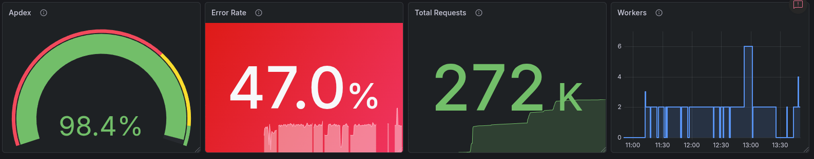
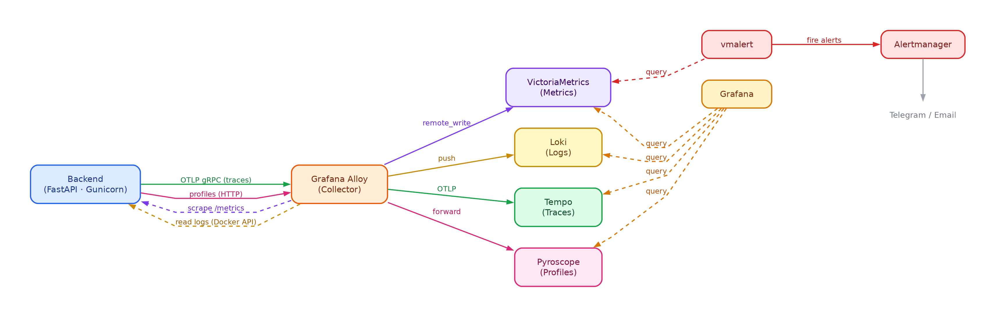
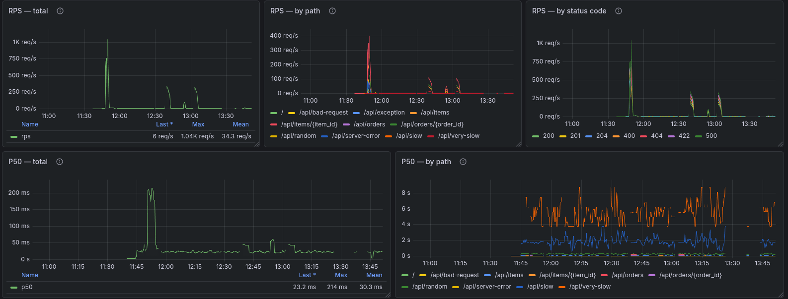
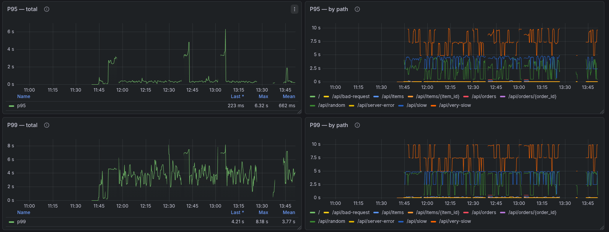
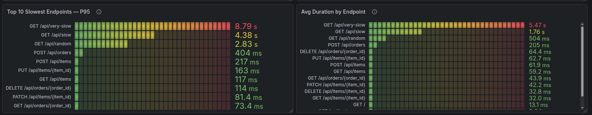
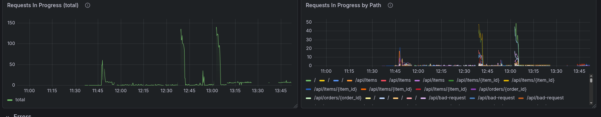
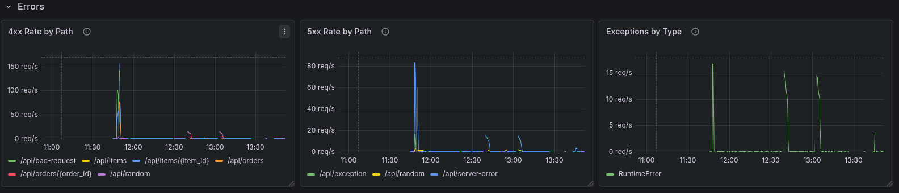
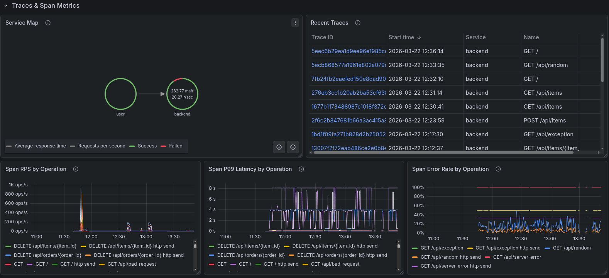
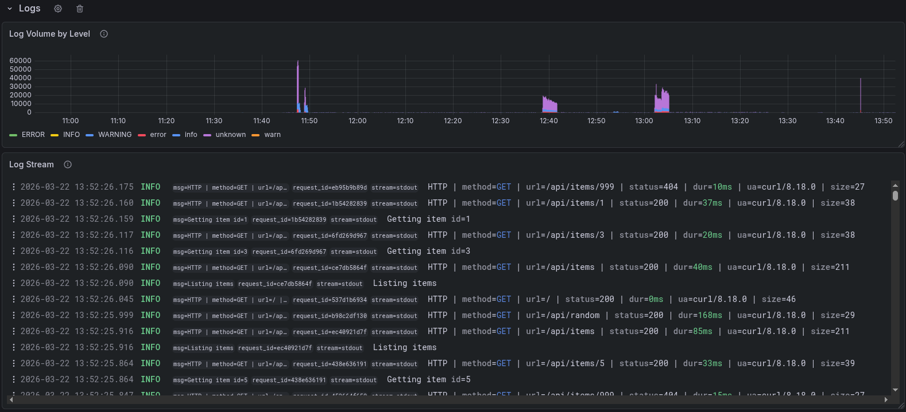
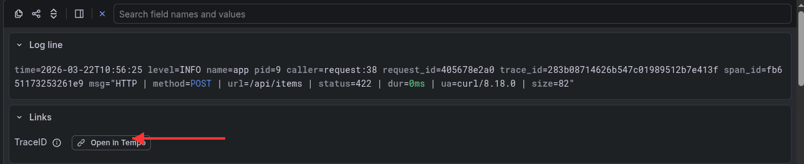

# Observability Docker Stack

A full observability stack for a **Gunicorn/FastAPI** application, running entirely in Docker Compose.
Covers all four pillars — **metrics · logs · traces · profiles** — with alerting out of the box.

---

## Dashboard Preview



> Open `http://localhost:3000` after starting the stack. Use the **Project** dropdown to filter by Docker Compose project name.

---

## Architecture



### How each signal travels

**Metrics**
1. Backend exposes `/metrics` in Prometheus format (multiprocess-safe via `prometheus_multiproc`)
2. Alloy pulls it every 15s — opt-in via `metrics.scrape: "true"` docker label on any service
3. Alloy remote-writes to VictoriaMetrics
4. vmalert queries VictoriaMetrics every 15s → fires to Alertmanager → Telegram / email

**Logs**
1. Backend writes structured logfmt to stdout (includes `trace_id` on every line)
2. Alloy reads container stdout via Docker API — no log driver config needed
3. Docker Compose labels (`project`, `service`, `container`) are attached as Loki stream labels
4. Logs are queryable in Grafana with LogQL

**Traces**
1. Backend's OpenTelemetry SDK sends spans via OTLP gRPC → Alloy (`:4317`) → Tempo
2. Tempo generates span metrics (RPS, latency, errors per operation) and pushes them to VictoriaMetrics
3. `trace_id` in log lines creates a live link from any log entry to its full trace

**Profiles**
1. Pyroscope SDK pushes CPU flame graphs via HTTP → Alloy (`:4040`) → Pyroscope storage
2. Grafana links profiles to traces via Tempo's `tracesToProfiles` integration

---

## Grafana Dashboard

### Overview — Apdex · Error Rate · Total Requests · Workers


- **Apdex** — user satisfaction score based on latency thresholds
- **Error Rate** — percentage of 5xx responses
- **Total Requests** — cumulative request count
- **Workers** — live Gunicorn worker count (step graph, drops to 0 on crash)

---

### Throughput (RPS) · P50 Latency



- RPS total, broken down by path and by status code
- P50 latency — total and per path

---

### Latency — P95 · P99



P95 and P99 — total and broken down by path.



- **Top 10 Slowest Endpoints** (P95 bar gauge, color-coded green → red)
- **Average Duration** by endpoint

---

### In-flight Requests



Requests currently being processed — total and by path. Useful for detecting request pile-ups.

---

### Errors



- **4xx Rate** by path — client errors
- **5xx Rate** by path — server errors
- **Exceptions by Type** — unhandled Python exceptions with rate

---

### Traces & Span Metrics



- **Service Map** — visual request flow graph with avg latency and RPS per node
- **Recent Traces** — clickable list, opens full trace in Tempo
- **Span RPS / P99 Latency / Error Rate** — broken down per operation

---

### Logs



- **Log Volume by Level** — histogram showing INFO / ERROR / WARNING over time
- **Log Stream** — live log view; each line includes `request_id`, `trace_id`, `span_id`

---

### Cross-signal Navigation

Every log line contains a `trace_id` linking it to a distributed trace.

**Logs → Traces:**
1. Click any line in the Log Stream to expand it
2. In the **Links** section, click **"Open in Tempo"**



**From a Trace span** you can jump to:
- **Logs for this span** — correlated log lines in Loki
- **Span metrics** — RPS / latency / error rate for that operation
- **Profile** — CPU flame graph for that request

---

## Quick Start

### 1. Configure alerting

Edit `observability/alertmanager/config.yaml` and fill in the placeholders:

```yaml
global:
  smtp_smarthost: '<SMTP_HOST>:<SMTP_PORT>'   # e.g. smtp.gmail.com:587
  smtp_from: '<SMTP_FROM>'
  smtp_auth_username: '<SMTP_USERNAME>'
  smtp_auth_password: '<SMTP_PASSWORD>'

receivers:
  - name: 'default-receiver'
    email_configs:
      - to: '<ALERT_EMAIL>'

    telegram_configs:
      - bot_token: '<TELEGRAM_BOT_TOKEN>'     # from @BotFather → /newbot
        chat_id: <TELEGRAM_CHAT_ID>           # from @userinfobot
```

> If you only need Telegram — remove `email_configs`. If you only need email — remove `telegram_configs`.

### 2. Start

```bash
docker compose up -d
```

### 3. Open Grafana

```
http://localhost:3000   →  admin / admin
```

---

## Stack

| Component | Role | Version |
|---|---|---|
| **Grafana Alloy** | Collector — scrapes metrics, collects logs, receives traces & profiles | v1.12.0 |
| **VictoriaMetrics** | Metrics storage (Prometheus-compatible) | v1.131.0 |
| **vmalert** | Evaluates PromQL alert rules against VictoriaMetrics | v1.131.0 |
| **Alertmanager** | Alert routing, deduplication & notifications | v0.29.0 |
| **Loki** | Log storage & querying | v3.5.9 |
| **Tempo** | Distributed trace storage + span metrics generation | v2.8.0 |
| **Pyroscope** | Continuous profiling storage | v1.17.0 |
| **Grafana** | Dashboards, Explore, cross-signal navigation | v12.4.0 |
| **Backend** | Example FastAPI app (Gunicorn + Uvicorn workers) | — |

---

## Alerting

Rules live in `observability/vmalert/rules/fastapi.yaml`, evaluated every **15s**.

| Alert | Fires when | Severity | Delay |
|---|---|---|---|
| `BackendDown` | No metrics received from backend | critical | 1m |
| `HighErrorRate` | 5xx responses > 5% of total | warning | 2m |
| `HighLatencyP99` | p99 latency > 1s | warning | 2m |

- Critical alerts **suppress** warnings with the same `alertname` via inhibit rules
- All alerts route to `default-receiver` → Telegram + email
- To adjust thresholds — edit `expr` in `observability/vmalert/rules/fastapi.yaml`

---

## Adding Your Own Service

To opt a service into **metrics scraping**, add these docker labels:

```yaml
services:
  my-service:
    labels:
      metrics.scrape: "true"           # required
      metrics.path: "/custom/metrics"  # optional, defaults to /metrics
```

Alloy auto-discovers the container and attaches `project`, `service`, `container` labels.
**No Alloy config changes needed.**

> Logs are collected from **all** running containers automatically — no labels required.

---

## Multiple Environments

Run `dev` and `staging` side by side:

```bash
docker compose -p dev     up -d
docker compose -p staging up -d
```

Each project gets its own `project` label on all metrics and logs.
Switch between them in Grafana using the **Project** dropdown at the top of the dashboard.

---

## Project Structure

```
.
├── docker-compose.yaml
├── backend/                          # Example FastAPI app
│   ├── Dockerfile
│   ├── gunicorn.conf.py              # Worker lifecycle hooks (metrics on fork/exit)
│   └── src/
│       ├── main.py                   # FastAPI routes
│       ├── middleware/
│       │   ├── metrics.py            # Prometheus middleware
│       │   └── request.py            # Access log + request_id injection
│       └── observability/
│           ├── prometheus/           # Multiprocess-safe metrics setup
│           ├── opentelemetry/        # OTLP trace exporter
│           └── pyroscope/            # Continuous profiling
└── observability/
    ├── alloy/config.alloy            # Collector pipeline (metrics · logs · traces · profiles)
    ├── alertmanager/config.yaml      # Alert routing & notification receivers
    ├── grafana/provisioning/
    │   ├── dashboards/fastapi.json   # Auto-provisioned FastAPI dashboard
    │   └── datasources/              # All datasources pre-configured
    ├── loki/config.yaml              # Log storage configuration
    ├── tempo/config.yaml             # Trace storage + span metrics generation
    └── vmalert/rules/fastapi.yaml    # Alert rules
```

---

## Ports

| Service | Port | Purpose |
|---|---|---|
| Grafana | `3000` | Dashboards — `http://localhost:3000` |
| Backend API | `8000` | FastAPI docs — `http://localhost:8000/docs` |
| Alloy | `12345` | Pipeline debug UI — `http://localhost:12345` |
